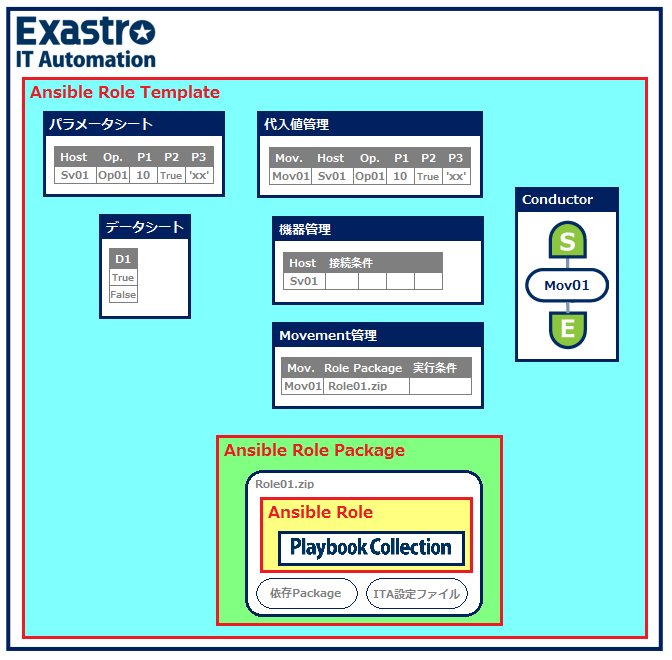

# Exastro Playbook Collection

[English](README.md) | 日本語  

## Description

本サービスでは、OS/MWの設定変更、設定値収集を行うためのAnsible Roleについて様々なAssetを公開しています  

## Assets

### 構成

各Assetの構成は以下のようになります  
　※ Host：対象ホスト、Op.：Operation、Mov.：Movement  
　※ Ansible Role Templateのパラメータシート、ホスト管理にはダミーのサンプルデータを設定  
  

### <a href="ansible_role_templates/README.md">Ansible Role Templates</a>

> **<h3>現時点では限定的に機能を実装したTrial Versionのみの公開となります</h3>**  
> 
> 上記サイトではAnsible Role Templateを公開しています  
> Ansible Role TemplateはExastro IT AutomationにAnsible Role Packageの組込みやRole実行に必要なメニュー／ジョブ等の構築などを行った上でエクスポートしたイメージファイルです  
> 公開パッケージ(kym)をダウンロードし、Exastro IT Automationへインポートしてパラメータ設定などを行うことでロールの実行を行えます  

### <a href="ansible_role_packages/README.md">Ansible Role Packages</a>

> 上記サイトではAnsible Role Packageを公開しています  
> Ansible Role PackageはAnsible Roleと依存パッケージ、Exastro IT Automationへの組込みに必要となる設定ファイル(ITA readme等)を含むZip形式の圧縮ファイルです  
> 公開パッケージ(zip)をダウンロードし、Exastro IT Automationへの組込みやメニュー／ジョブ等の構築、パラメータ設定などを行うことでロールの実行を行えます  

### <a href="ansible_roles/README.md">Ansible Roles</a>

> 上記サイトではAnsibleによりOS/MWの環境構築、設定変更や設定情報収集を行うためのAnsible Roleを公開しています  

