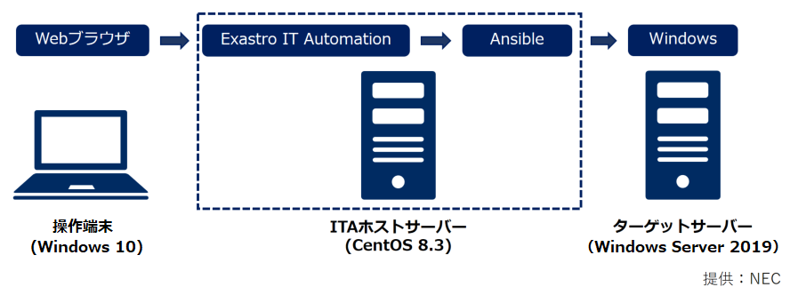

# Ansible Playbook Collection

[English](README.md) | 日本語  

## Description

本サービスでは、Ansible Playbookのコード（Role）をExastro IT Automation（以降、ITAと表記）で簡単にインポートしてご利用いただくためITA向け設定ファイルを同梱したロールパッケージを提供しています  
AnsibleでRoleを使用される場合は[こちらのページ](README_ansible.ja.md)を参照ください  

## Role Package

| 対象製品 | バージョン | 機能                 | ロールパッケージ                                             | 機能概要                                                     | 利用方法                                                     |  
| -------- | ---------- | -------------------- | ------------------------------------------------------------ | ------------------------------------------------------------ | ------------------------------------------------------------ |  
| OS       | WS2019     | 環境構築 ＆ 設定収集 | [OS-Windows2019](https://github.com/exastro-playbook-collection/OS-Windows2019/releases/download/v21.04/OS-Windows2019.zip) | OSの環境構築、設定変更、およびOS設定値収集、再利用可能なパラメータファイルの生成を行う | [Readme](https://github.com/exastro-playbook-collection/OS-Windows2019/blob/master/README.md)<br>[注意事項](attention/OS-Windows2019.ja.md) |  
| OS       | WS2016     | 環境構築 ＆ 設定収集 | [OS-Windows2016](https://github.com/exastro-playbook-collection/OS-Windows2016/releases/download/v21.04/OS-Windows2016.zip) | OSの環境構築、設定変更、およびOS設定値収集、再利用可能なパラメータファイルの生成を行う | [Readme](https://github.com/exastro-playbook-collection/OS-Windows2016/blob/master/README.md)<br>[注意事項](attention/OS-Windows2016.ja.md) |  
| OS       | RHEL8      | 環境構築 ＆ 設定収集 | [OS-RHEL8](https://github.com/exastro-playbook-collection/OS-RHEL8/releases/download/v21.04/OS-RHEL8.zip)                   | OSの環境構築、設定変更、およびOS設定値収集、再利用可能なパラメータファイルの生成を行う | [Readme](https://github.com/exastro-playbook-collection/OS-RHEL8/blob/master/README.md)<br>[注意事項](attention/OS-RHEL8.ja.md) |  
| OS       | RHEL7      | 環境構築 ＆ 設定収集 | [OS-RHEL7](https://github.com/exastro-playbook-collection/OS-RHEL7/releases/download/v21.04/OS-RHEL7.zip)                   | OSの環境構築、設定変更、およびOS設定値収集、再利用可能なパラメータファイルの生成を行う | [Readme](https://github.com/exastro-playbook-collection/OS-RHEL7/blob/master/README.md)<br>[注意事項](attention/OS-RHEL7.ja.md) |  

## Support

各ロールパッケージの「利用方法」の「Readme」を参照ください  

## Usage

ここではITAにWS2019の環境構築・設定収集用ロールパッケージをインポートしてRoleを実行する場合の例を示します  

### システム構成

以下の構成で作業を行います  


### 準備作業

本手順はITAで設定収集を行う場合に一度だけ実行する必要があります  
以降の手順は特に明記の無い限りITAホストサーバ上で実行します  

1. ITAホストサーバにsudo権限を付与したユーザでログインします  

2. 必要なツールをインストールします  
    ```
    sudo yum -y install git wget
    ```

3. Playbook実行フォルダを作成し、フォルダ下に移動します  
    ```
    mkdir ansible_work
    cd ansible_work/
    ```

4. [パラメータ生成共通部品のロールリスト](https://exastro-suite.github.io/playbook-collection-docs/requirements/prerequire_list.yml)をダウンロードし、手順(3)で作成したフォルダに配置します  
    ```
    wget https://exastro-suite.github.io/playbook-collection-docs/requirements/prerequire_list.yml
    ```

5. ansible-galaxyコマンドでロールをダウンロードします  
    ```
    ansible-galaxy install -r prerequire_list.yml -p roles
    ```

6. 以下を参考にPlaybookとインベントリを作成します  
    * Playbook(prerequire.yml)
        ```
        ---
        - hosts: local
          become: yes
          roles:
            - setup_paragen
        ```
    * インベントリ(inventory)
        ```
        [local]
        localhost

        [local:vars]
        ansible_python_interpreter=/usr/bin/python3
        ansible_become_pass=<sudoパスワード>
        ```
        (*) AnsibleをPython2で動作させる場合、ansible_python_interpreterの定義は不要

7. Playbookを実行してパラメータ生成用共通部品をインストールします  
    ```
    ansible-playbook -c local -i inventory prerequire.yml
    ```

### ロールパッケージ実行

以降の手順は特に明記の無い限り操作端末上で実行します  

1. 「Role Package」一覧から対象製品のロールパッケージをダウンロードし、ローカル環境に格納します  

2. 「Role Package」一覧の「利用方法」欄に「注意事項」のリンクがある場合は内容を確認し、必要に応じて対応を行ってください  

3. ITAにロールパッケージをインポートした後、ITAの仕様に沿ってロールの実行を行います  
　* 作業手順については[ITAの利用手順マニュアル](https://exastro-suite.github.io/it-automation-docs/documents_ja.html)の以下を参照ください  
　　「利用手順マニュアル Ansible-driver」  
　　　　4.1.2 Ansible-Legacy Role 作業フロー  
