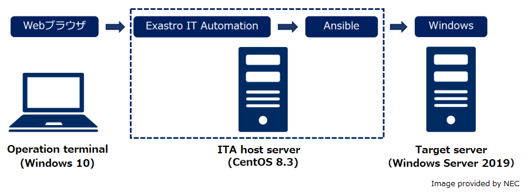

# Ansible Playbook Collection

English | [Japanese](README.ja.md)  

## Description

This site provides Role Packages for easy import of Ansible Playbooks (Role) with Exastro IT Automation (hereinafter referred to as ITA).  
If you use Role with Ansible, please refer to [this page](README_ansible.md).  

## Role Package

| Target Product | Version | Function | Role Package | Summary | How to use |  
| -------- | ---------- | -------------------- | ------------------------------------------------------------ | ------------------------------------------------------------ | ------------------------------------------------------------ |  
| OS       | WS2019     | environmental construction & parameter collection | [OS-Windows2019](https://github.com/exastro-playbook-collection/OS-Windows2019/releases/download/v21.04/OS-Windows2019.zip) | This role provides functions to build the OS environment and change settings and collect OS settings and create a reusable parameter file. | [Readme](https://github.com/exastro-playbook-collection/OS-Windows2019/blob/master/README.md)<br>[Cautionary Notes](attention/OS-Windows2019.md) |  
| OS       | WS2016     | environmental construction & parameter collection | [OS-Windows2016](https://github.com/exastro-playbook-collection/OS-Windows2016/releases/download/v21.04/OS-Windows2016.zip) | This role provides functions to build the OS environment and change settings and collect OS settings and create a reusable parameter file. | [Readme](https://github.com/exastro-playbook-collection/OS-Windows2016/blob/master/README.md)<br>[Cautionary Notes](attention/OS-Windows2016.md) |  
| OS       | RHEL8      | environmental construction & parameter collection | [OS-RHEL8](https://github.com/exastro-playbook-collection/OS-RHEL8/releases/download/v21.04/OS-RHEL8.zip) | This role provides functions to build the OS environment and change settings and collect OS settings and create a reusable parameter file. | [Readme](https://github.com/exastro-playbook-collection/OS-RHEL8/blob/master/README.md)<br>[Cautionary Notes](attention/OS-RHEL8.md) |  

## Support

For more details, refer to "How to use" of each role.  

## Usage

This example shows how to import the WS2019 Role Package for environment setup and configuration collection into ITA and execute the role.  

### Support

In this case, you will work with the following configuration.  


### Pre-work

This step should only be performed once for parameter collection with ITA.  
The following steps will be executed on ITA host server unless otherwise specified.  

1. Build ITA host server and login as a user with sudo privileges.  

2.  Install the required tools.  
    ```
    sudo yum -y install git wget
    ```

3. Create a working folder and change to the folder.  
    ```
    mkdir ansible_work
    cd ansible_work/
    ```

4. Download the [Role List for Parameter Generation Common Parts](https://exastro-suite.github.io/playbook-collection-docs/requirements/prerequire_list.yml) and place it in the folder you created in step (3).  
    ```
    wget https://exastro-suite.github.io/playbook-collection-docs/requirements/prerequire_list.yml
    ```

5. Download a role with the ansible-galaxy Command.  
    ```
    ansible-galaxy install -r prerequire_list.yml -p roles
    ```

6. Create a playbook and an inventory file.  
    * Playbook(prerequire.yml)
        ```
        ---
        - hosts: local
          become: yes
          roles:
            - setup_paragen
        ```
    * Inventory(inventory)
        ```
        [local]
        localhost

        [local:vars]
        ansible_python_interpreter=/usr/bin/python3
        ansible_become_pass=<sudo password>
        ```
        (*) You don't have to set the variable 'ansible_python_interpreter' if use ansible with python2.  

7. Run the playbook to install Parameter Generation Common Parts.  
    ```
    ansible-playbook -c local -i inventory prerequire.yml
    ```

### Run Role Package

The following steps are performed on the operation terminal unless otherwise specified.  

1. Download the target product role package from the list and store it locally.  

2. If there is a link for "Cautionary Notes" in the "How to use" column of the list, check the contents and take action as necessary.  

3. After importing the role package into ITA, perform the role according to the ITA specifications.  
  * For instructions, refer to the following in Documents.  
    https://exastro-suite.github.io/it-automation-docs/documents.html  
      User Instruction Manual - Ansible-driver  
        4.1.2 Workflow of Ansible-Legacy Role  
