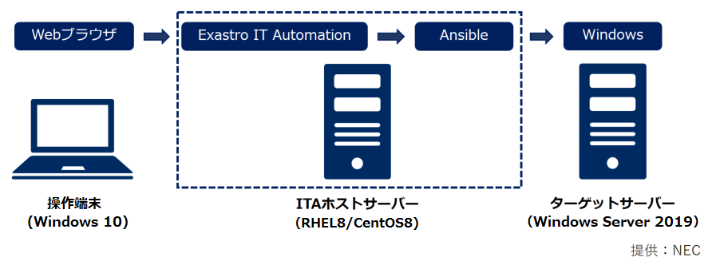

# Exastro Playbook Collection - Ansible Role Template

## Description

本サイトではAnsible Role Templateを公開しています  
Ansible Role TemplateはExastro IT AutomationにAnsible Role Packageの組込みやRole実行に必要なメニュー／ジョブ等の構築などを行った上でエクスポートしたイメージファイルです  
公開パッケージ(kym)をダウンロードし、Exastro IT Automationへのインポートと初期設定を行うことでロールの実行を行えます  

## Ansible Role Template

**現時点では限定的に機能を実装したTrial Versionのみの配布となります**  
**制限事項については「How to use」欄の「制限事項」を参照ください**  

| 対象製品 | Version    | 機能     | ITA Version | パッケージ(kym)                                              | 機能概要                                                                                         | How to use                                                     |  
| -------- | ---------- | -------- | ----------- | ------------------------------------------------------------ | ------------------------------------------------------------------------------------------------ | -------------------------------------------------------------- |  
| OS       | WS2019     | 環境構築 | Ver. 1.8.0  | [OS-Windows2019](https://github.com/exastro-playbook-collection/OS-Windows2019/releases/download/v21.04/ansible-template-os-windows-ce-trial-exastro-1.8.0.kym) | OSの環境構築、設定変更、およびOS設定値収集、再利用可能なパラメータファイルの生成を行う | [Readme](https://github.com/exastro-playbook-collection/OS-Windows2019/blob/master/README.md)<br>[注意事項](attention/OS-Windows2019.ja.md)<br>[制限事項](limitation/OS-Windows2019.ja.md) |  
| OS       | RHEL8      | 環境構築 | Ver. 1.8.0  | [OS-RHEL8](https://github.com/exastro-playbook-collection/OS-RHEL8/releases/download/v21.04/ansible-template-os-rhel8-ce-trial-exastro-1.8.0.kym)               | OSの環境構築、設定変更、およびOS設定値収集、再利用可能なパラメータファイルの生成を行う | [Readme](https://github.com/exastro-playbook-collection/OS-RHEL8/blob/master/README.md)<br>[注意事項](attention/OS-RHEL8.ja.md)<br>[制限事項](limitation/OS-RHEL8.ja.md) |  

## Support

対象ホストの諸元等については「Ansible Role Template」一覧の「How to use」／「Readme」を参照ください  

## Usage

ここではITAにWS2019の環境構築用Ansible Role Template Trial VersionをインポートしてRoleを実行する場合の例を示します  

### システム構成

以下の構成で作業を行います  
  

### 準備作業

本手順はITAで設定収集を行う場合に一度だけ実行する必要があります  
以降の手順は特に明記の無い限りITAホストサーバ上で実行します  

1. ITAホストサーバにITAのインストールを行います  
   * インストール手順は[「Exastro IT Automation を導入しよう」](https://exastro-suite.github.io/it-automation-docs/install_ja.html)を参照ください  
   * インストールするITAのバージョンは、「Ansible Role Template」一覧の「ITA Version」を参照ください  

2. ITAホストサーバにsudo権限を付与したユーザでログインします  

3. 必要なツールをインストールします  
    ```
    sudo yum -y install git wget
    ```

4. Playbook実行フォルダを作成し、フォルダ下に移動します  
    ```
    mkdir ansible_work
    cd ansible_work/
    ```

5. [パラメータ生成共通部品のロールリスト](../requirements/prerequire_list.yml)をダウンロードし、手順(3)で作成したフォルダに配置します  
    ```
    wget https://exastro-suite.github.io/playbook-collection-docs/requirements/prerequire_list.yml
    ```

6. ansible-galaxyコマンドでロールをダウンロードします  
    ```
    ansible-galaxy install -r prerequire_list.yml -p roles
    ```

7. 以下を参考にPlaybookとインベントリを作成します  
    * Playbook(prerequire.yml)
        ```
        ---
        - hosts: local
          become: yes
          roles:
            - setup_paragen
        ```
    * インベントリ(inventory)
        ```
        [local]
        localhost

        [local:vars]
        ansible_python_interpreter=/usr/bin/python3
        ansible_become_pass=<sudoパスワード>
        ```
        (*) AnsibleをPython2で動作させる場合、ansible_python_interpreterの定義は不要

8. Playbookを実行してパラメータ生成用共通部品をインストールします  
    ```
    ansible-playbook -c local -i inventory prerequire.yml
    ```

9. 以下のように"failed=0"で終了したことを確認します  
（failed以外の値は環境によって変わる可能性があります）
    ```
    PLAY RECAP *********************************************************************************
    localhost                  : ok=4    changed=3    unreachable=0    failed=0    skipped=0 ...
    ```

### ロールの実行

以降の手順は特に明記の無い限り操作端末上で実行します  

1. 「Ansible Role Template」一覧から対象製品のパッケージ(kym)をダウンロードし、操作端末の適当なフォルダに格納します  
    - 「How to use」欄に「制限事項」「注意事項」のリンクがある場合は内容を確認し、必要に応じて対応を行ってください  

2. ITAに"administrator"でログインし、初期パスワードを変更します  
    - インポート後に別のパスワードへの変更が必要となるため、ここでは使用したいパスワードとは別の適当な値を入力します  

3. 「メインメニュー」＞「エクスポート／インポート」＞「メニューインポート」メニューを開きます  
「ファイルを選択」からダウンロードしたパッケージ(kym)を選択し、「アップロード」ボタンを押します  
「インポート」の「すべてのメニュー」が選択されていることを確認し、画面下部の「インポート」を押してインポートを開始します  

4. 「メインメニュー」＞「エクスポート／インポート」＞「メニューエクスポート・インポート管理」メニューを開きます  
「フィルタ」ボタンを何度か押し、実行中のインポート処理のステータスが「完了」になるのを待ちます  
（パスワード変更の画面が表示された場合、パスワードを"password"から任意の文字列に変更してください）  

5. ログアウトした後に"administrator"で再ログインします  
    - パスワードは"password"に変更されています  

6. 画面右上の「パスワード変更」ボタンを押し、パスワードを変更します  
    - この時、インポート前、インポート中に設定したパスワードは再利用できませんのでご注意ください  

7. 「メインメニュー」＞「基本コンソール」＞「機器一覧」メニューを開きます  
「フィルタ」ボタンを押して表示されるデータを更新するか、「登録」からホストを新規登録します  
    - 登録済データのホスト名、IPアドレス、ログインユーザID、パスワード等にはサンプル値が入力されています  

8. 「メインメニュー」＞「基本コンソール」＞「オペレーション一覧」メニューを開きます  
オペレーションを新規登録します  
    - 実施予定日時は登録時点の日時を指定して問題ありません  

9. 「メインメニュー」＞「入力用」メニューグループを開きます  
利用するロールに対応するメニューを開き、ロール実行用のパラメータを入力します  
    - ホスト、オペレーションには、本手順で更新、新規登録したものを選択します  
    - 複数の設定を配列として指定する変数の指定可能最大数を拡張する場合、以下の手順で変更します  
        1. 「メニュー作成」＞「メニュー定義・管理」から対応するメニューのRepeat数を必要な値に変更します  
        2. 「Ansible-LegacyRole」＞「変数ネスト管理」で対象変数の「最大繰り返し数」を必要な値に変更します  
        3. 「Ansible-LegacyRole」＞「代入値自動登録設定」でメニューと変数の紐付けを行います  

10. 「メインメニュー」＞「Conductor」＞「Conductor作業実行」メニューを開きます  
実行するConductorと、本手順で新規登録したオペレーションを選択します  

11. 「Conductor実行」に表示されているロールの内、利用しないロールを選択して「Skip」をチェックします  
    - Conductorに含まれる全てのロールを実行する場合、本手順は不要です  

12. 画面下部の「実行」ボタンを押してConductorを実行します  
全てのロールが「SKIP」もしくは「Done」になれば実行は完了です  
    - 作業状況、結果の詳細については、対象のロールを選択して「Operation Status」の「作業状態確認」から確認できます  

* 各作業手順の詳細については[ITAの利用手順マニュアル](https://exastro-suite.github.io/it-automation-docs/documents_ja.html)の以下を参照ください  
　「利用手順マニュアル Ansible-driver」  
