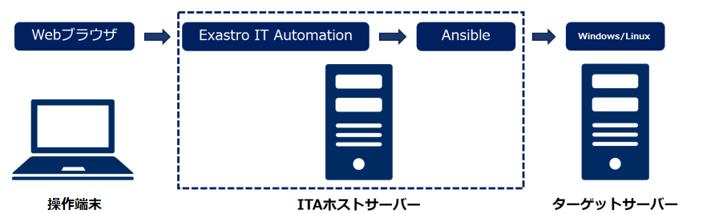

# Exastro Playbook Collection - Ansible Role Template

## Description

本サイトではAnsible Role Templateを公開しています  
Ansible Role TemplateはExastro IT AutomationにAnsible Role Packageの組込みやRole実行に必要なメニュー／ジョブ等の構築などを行った上でエクスポートしたイメージファイルです  
公開パッケージ(kym)をダウンロードし、Exastro IT Automationへのインポートと初期設定を行うことでロールの実行を行えます  


## Ansible Role Template

**制限事項については「How to use」欄の「制限事項」を参照ください**  

| 対象製品 | Version    | ITA Version | パッケージ(kym)                                              | 機能概要                                                                                              | How to use                                                     |  
| -------- | ---------- | ----------- | ------------------------------------------------------------ | ----------------------------------------------------------------------------------------------------- | -------------------------------------------------------------- |  
| OS       | RHEL9      | Ver. 2.2.1 | [OS-RHEL9](https://github.com/exastro-playbook-collection/OS-RHEL9/releases/download/v2/ansible-role-template-os-rhel9-ce-exastro-2.2.1.kym)                     | OSの環境構築、設定変更、およびOS設定値収集、<br>再利用可能なパラメータファイルの生成を行う | [Role Readme](https://github.com/exastro-playbook-collection/OS-RHEL9/blob/master/README.md)<br>[注意事項](attention/ansible-role-template-os-rhel9-ce-exastro-2.2.1.ja.md)<br>[制限事項](limitation/ansible-role-template-os-rhel9-ce-exastro-2.2.1.ja.md) |  
| OS       | WS2022      | Ver. 2.2.1 | [OS-Windows2022](https://github.com/exastro-playbook-collection/OS-Windows2022/releases/download/v2/ansible-role-template-os-windows2022-ce-exastro-2.2.1.kym)                     | OSの環境構築、設定変更、およびOS設定値収集、<br>再利用可能なパラメータファイルの生成を行う | [Role Readme](https://github.com/exastro-playbook-collection/OS-Windows2022/blob/master/README.md)<br>[注意事項](attention/ansible-role-template-os-windows2022-ce-exastro-2.2.1.ja.md)<br>[制限事項](limitation/ansible-role-template-os-windows2022-ce-exastro-2.2.1.ja.md) |  

## Support

Ansible Role 対象ホストの諸元等については「Ansible Role Template」一覧の「How to use」／「Role Readme」を参照ください  


## Usage

ここではITAにRHEL9の環境構築用Ansible Role TemplateをインポートしてRoleを実行する場合の例を示します  


### システム構成

以下の構成で作業を行います  
  


### ITAサーバーの環境構築を行う

本手順はITAサーバで一度だけ実行する必要があります  
以降の手順は特に明記の無い限りITAホストサーバ上で実行します  

1. ITAホストサーバにITAのインストールを行います  
   * インストール手順については[「Exastro IT Automation を導入しよう」](https://ita-docs.exastro.org/2.2/ja/installation/index.html)を参照ください  
   * インストールするITAのバージョンは、「Ansible Role Template」一覧の「ITA Version」を参照ください  

2. ITAにログインして、オーガナイゼーションおよびワークスペースを作成します

3. 必要なツールをインストールします  
    ```
    sudo yum -y install git wget
    ```

4. Playbook実行フォルダを作成し、フォルダ下に移動します  
    ```
    mkdir ansible_work
    cd ansible_work/
    ```

5. [共通部品のロールリスト](../requirements/prerequire_list.yml)をダウンロードし、手順(3)で作成したフォルダに配置します  
    ```
    wget https://exastro-suite.github.io/playbook-collection-docs/requirements/prerequire_list.yml
    ```

6. ITAフォルダにコピー
    ```
    cp ./parameter_generate.tar.gz /home/<ITAユーザ>/exastro-docker-compose/ita_by_ansible_execute/templates/work/
    cp ./ita_role_adapter.tar.gz /home/<ITAユーザ>/exastro-docker-compose/ita_by_ansible_execute/templates/work/
    
    cd /home/<ITAユーザ>/exastro-docker-compose/ita_by_ansible_execute/templates/work
    tar -zxvf parameter_generate.tar.gz
    tar -zxvf ita_role_adapter.tar.gz
    ```

7. 共通部品をインストール
　　/home/<ITAユーザ>/exastro-docker-compose/ita_by_ansible_execute/templates/work/Dockfileに下記の内容を追加します。
    ```
    USER root
    
    RUN mkdir -p /usr/share/ansible/plugins/action/
    
    COPY parameter_generate /home/parameter_generate
    WORKDIR /home/parameter_generate/
    RUN cp roles/setup_paragen/files/action_plugins/parameter_generate.py /usr/share/ansible/plugins/action/parameter_generate.py
    RUN ansible-playbook -c local -i inventory prerequire.yml
    
    COPY ita_role_adapter /home/ita_role_adapter
    WORKDIR /home/ita_role_adapter/
    RUN ansible-playbook -c local -i inventory prerequire.yml
    ```

### Ansible Role Templateを利用する

以降の手順は特に明記の無い限り操作端末上で実行します  


【ITAホストサーバーの初期設定を行う】  

以降の手順は特に明記の無い限り操作端末上で実行します  

1. 「Ansible Role Template」一覧から対象製品のパッケージ(kym)をダウンロードし、操作端末の適当なフォルダに格納します  
    - 「How to use」欄に「制限事項」「注意事項」のリンクがある場合は内容を確認し、必要に応じて対応を行ってください  

2. ブラウザでITAホストサーバーに接続し、"administrator"（システム管理者）でログインします  
　　オーガナイゼーションおよびワークスペースを作成します

3.　作成したワークスペースをログインします

4. 「メインメニュー」＞「エクスポート／インポート」＞「メニューインポート」メニューを開きます  
「ファイルを選択」からダウンロードしたパッケージ(kym)を選択し、「アップロード」ボタンを押します  
「インポート」の「すべてのメニュー」が選択されていることを確認し、画面下部の「インポート」を押してインポートを開始します  

5. 「メインメニュー」＞「エクスポート／インポート」＞「メニューエクスポート・インポート管理」メニューを開きます  
「フィルタ」ボタンを押して画面更新し、実行中のインポート処理のステータスが「完了」になるのを待ちます  

6. 「メインメニュー」＞「基本コンソール」＞「機器一覧」メニューを開きます  
   「フィルタ」ボタンを押して表示される登録済ホスト情報をターゲットサーバーの設定にあわせて更新します  
    - 登録済ホスト情報のホスト名、IPアドレス、ログインユーザID、パスワード等にはサンプル値が入力されています  

【ターゲットサーバーの設定値収集を行う】   

1. 「メインメニュー」＞「入力用」＞「収集_RHEL9_＜利用するロール名＞」メニューを開きます
「フィルタ」ボタンを押し、必要に応じてパラメータを更新します  

2. 「メインメニュー」＞「Conductor」＞「Conductor編集/作業実行」メニューを開きます  
「RHEL9_収集」Conductorとインポートしたオペレーションを選択します  

3. 「Conductor」に表示されているMovementの内、利用しないMovementについては「Skip」をチェックします  
    - Conductorに登録された全てのMovementを実行する場合、本手順は不要です  

4. 画面下部の「実行」ボタンを押してConductorを実行します  
全てのロールが「SKIP」もしくは「Done」になれば実行は完了です  
    - 作業状況、結果の詳細については、対象のロールを選択して確認できます  

5. 「メインメニュー」＞「入力用」＞「収集結果_RHEL9_＜利用するロール名＞」メニューを開きます  
「フィルタ」ボタンを押して表示されるパラメータから収集内容を確認します  


【ターゲットサーバーの環境構築、設定変更を行う】  

以降の手順は特に明記の無い限り操作端末上で実行します  

1. 「メインメニュー」＞「入力用」＞「構築_RHEL9_＜利用するロール名＞」メニューを開きます  
必要に応じて「フィルタ」ボタンを押して表示されるパラメータを更新します  

2. 「メインメニュー」＞「Conductor」＞「Conductor編集/作業実行」メニューを開きます  
「RHEL9_構築」Conductorとインポートしたオペレーションを選択します    

3. 「Conductor」に表示されているMovementの内、利用しないMovementについては「Skip」をチェックします  
    - Conductorに登録された全てのMovementを実行する場合、本手順は不要です 

4. 画面下部の「実行」ボタンを押してConductorを実行します  
   全てのロールが「SKIP」もしくは「Done」になれば実行は完了です  
    - 作業状況、結果の詳細については、対象のロールを選択して確認できます  

### 備考

* 各作業手順の詳細については[ITAの利用手順マニュアル](https://ita-docs.exastro.org/2.2/ja/manuals/index.html)の以下を参照ください  
　「Ansible ドライバ」  

